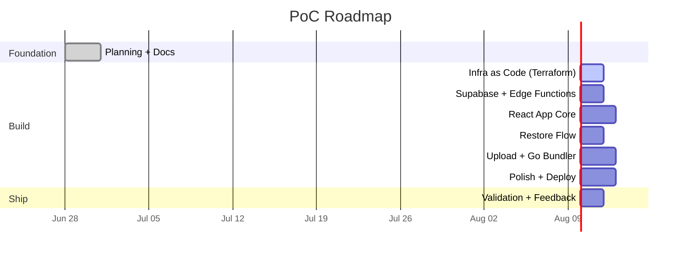

# PoC Roadmap

> **Goal**: A working backup app that both technical and non-technical users can use.
> **Total effort**: ~36–40 hours (8–9 evenings or two focused weekends).
> **Date**: June 2026

---

## Current Focus

🎯 **Phase 1: Infrastructure as Code** — Write Terraform files for S3, IAM, CORS, storage classes. Nothing can be built until we have a bucket.

⬜ Not started &nbsp;|&nbsp; ~2 hours &nbsp;|&nbsp; [`infra/`](../infra/) &nbsp;|&nbsp; Owner: Technical user

---

## Timeline



---

## Phase Overview

| # | Phase | Est. Time | Dependencies | Status |
|---|-------|-----------|-------------|--------|
| 0 | **Foundation** — planning, docs, dev setup | ~3h | None | ✅ Done |
| 1 | **Infrastructure as Code** — Terraform S3, IAM, CORS | ~3h | Phase 0 | ⬜ Ready |
| 2 | **Supabase + Edge Functions** — auth, function skeleton | ~4h | Phase 1 | ⬜ Ready |
| 3 | **React App Core** — login, album browser, multi-part UI | ~6h | Phase 2 | ⬜ Ready |
| 4 | **Restore Flow** — request, status polling, download | ~5.5h | Phase 3 | ⬜ Ready |
| 5 | **Upload + Go Bundler** — upload flow, bundler Lambda | ~7h | Phase 1 | ⬜ Ready |
| 6 | **Polish + Deploy** — size guard, CI/CD, notifications | ~5.5h | Phase 4, 5 | ⬜ Ready |
| 7 | **Validation** — E2E testing, non-technical user feedback, fixes | ~3h | Phase 6 | ⬜ Ready |

---

## Phase Details

### Phase 0: Foundation ✅ Done

What's already in place:

- `PLANNING.md` — full PoC document with Option B (3-month bundling, no lifecycle transition)
- `docs/architecture.md` — architecture diagram and data flow
- `docs/vision.md`, `docs/mission.md` — project vision
- `docs/react-style.md` — React conventions, Vitest + Playwright strategy
- `docs/development.md` — step-by-step dev guide
- `docs/decisions.md` — ADRs for 7 key architectural decisions
- `docs/roadmap.md` — this file
- Docker dev setup with Bun + hot reload
- `.gitignore` covering Go, Node, Terraform, IDE files
- `planning` branch on GitHub with all changes committed

---

### Phase 1: Infrastructure as Code 🏗️

**Goal**: All AWS resources defined in Terraform. `tofu apply` creates everything.

| Task | Effort | Dependencies |
|------|--------|-------------|
| `infra/providers.tf` — AWS provider, region (eu-central-1) | 15 min | None |
| `infra/main.tf` — S3 bucket, Intelligent-Tiering config, CORS, encryption, public access block | 1h | providers.tf |
| `infra/iam.tf` — IAM roles for Edge Functions, bundler Lambda, notification Lambda | 1h | main.tf |
| `infra/bundler.tf` — Go Bundler Lambda + EventBridge Scheduler rule | 1h | main.tf |
| `infra/notifications.tf` — SNS topic, SES template, notification Lambda | 30 min | main.tf |
| `infra/variables.tf`, `outputs.tf`, `terraform.tfvars.example` | 30 min | None |
| `tofu init && tofu plan` — verify everything is correct | 15 min | All above |

**Success**: Running `tofu apply` creates an S3 bucket with correct CORS, encryption, IAM roles, and Lambda functions. No lifecycle rule transitions `hot/` to Glacier.

---

### Phase 2: Supabase + Edge Functions 🔐

**Goal**: Users can log in. Edge Functions can be called and return real S3 data.

| Task | Effort | Dependencies |
|------|--------|-------------|
| Create Supabase project, enable magic links | 30 min | Phase 1 (bucket exists) |
| Store AWS keys as Supabase Secrets | 15 min | Supabase project |
| `list-prefixes` — list hot/ + archive/ prefixes, detect multi-part | 1h | Supabase project |
| `request-restore` — issue `RestoreObjectCommand` per part | 45 min | list-prefixes |
| `get-download-urls` — check restore status, return presigned URLs | 45 min | request-restore |
| `upload-file` — presigned POST to hot/ prefix | 30 min | Supabase project |
| `delete-files` — delete marker + version delete | 30 min | Supabase project |
| Deploy all functions to Supabase | 15 min | All functions |

**Success**: `curl` to each Edge Function returns correct responses. Magic link email is sent and login works.

---

### Phase 3: React App Core 🖥️

**Goal**: A working web app with login, album browsing, and multi-part UI.

| Task | Effort | Dependencies |
|------|--------|-------------|
| Scaffold React + Vite + TypeScript + Tailwind | 30 min | None |
| Implement magic link login page (`Login.tsx`) | 1h | Phase 2 (Supabase project) |
| Set up Supabase client + TanStack Query | 30 min | Login page |
| Build `AlbumCard` component (hot + archive, multi-part) | 1h | Supabase client |
| Build album browser page (`Albums.tsx`) with merged hot/archive view | 1.5h | AlbumCard |
| Build multi-part album detail UI (`PartList`) | 1h | AlbumCard |
| Build `StatusBadge` for restore status transitions | 30 min | None |
| Build `ActiveRestores` page | 30 min | StatusBadge |

**Success**: Log in, see albums from both hot/ and archive/ merged chronologically, see multi-part indicators and extraction instructions.

---

### Phase 4: Restore Flow 🔄

**Goal**: One-click restore with status polling and download.

| Task | Effort | Dependencies |
|------|--------|-------------|
| `useRestoreStatus` hook — poll all parts until ready | 1h | Phase 2 (request-restore, get-download-urls) |
| `RestoreButton` with confirmation + size guard check | 1h | Phase 3 (album browser) |
| `DownloadList` — per-part + "Download All" buttons | 1h | useRestoreStatus |
| Wire up full restore flow (click → confirm → poll → download) | 1.5h | All above |

**Success**: Click "Restore" on an archive album → see "Restoring… (12–48h)" → poll updates status → when ready, download buttons appear for each part. Multi-part albums show clear instructions.

---

### Phase 5: Upload + Go Bundler 📤

**Goal**: Files can be uploaded and are automatically bundled after 3 months.

| Task | Effort | Dependencies |
|------|--------|-------------|
| `upload-file` Edge Function — presigned POST | 30 min | Phase 1 (bucket), Phase 2 |
| Upload UI — file picker, progress indicator | 1.5h | Phase 2 |
| Go Bundler Lambda `main.go` — scan, group by YYYY-MM, streaming ZIP | 2h | Phase 1 (bucket) |
| `splitter.go` — multi-part splitting logic | 1.5h | main.go |
| `splitter_test.go` — unit tests for splitting | 30 min | splitter.go |
| bundler `Makefile` — build, test, package | 30 min | All Go files |
| Terraform `bundler.tf` (already in Phase 1, update if needed) | 30 min | Go Lambda ZIP |

**Success**: Upload a file via the UI → it appears in hot/ bucket prefix. Run the bundler locally in dry-run mode → it correctly groups files, creates ZIPs (with splitting for large months), and logs what it would do.

---

### Phase 6: Polish + Deploy 🚀

**Goal**: Production-ready app with safety nets and CI/CD.

| Task | Effort | Dependencies |
|------|--------|-------------|
| `useRestoreSizeGuard` hook + `SizeGuardBanner` (100 GB egress warning) | 1h | Phase 3 |
| GitHub Actions workflow for Pages deploy | 1h | Phase 3 (React app) |
| Basic SNS → plain text email notification | 1h | Phase 1 (SNS topic) |
| Go notification Lambda + SES template (post-PoC enhancement) | 2h | Phase 1 |
| Staggered UI for large albums exceeding 100 GB | 30 min | SizeGuardBanner |
| localStorage cumulative egress tracking | 30 min | SizeGuardBanner |

**Success**: GitHub Pages auto-deploys on push. Frontend guard warns when approaching 100 GB/month egress. SNS sends email when restore completes.

---

### Phase 7: Validation ✅

**Goal**: Confirm everything works and non-technical users can use it.

| Task | Effort | Dependencies |
|------|--------|-------------|
| End-to-end test: upload → hot storage → bundler → archive → restore → download | 1.5h | Phase 6 |
| Test multi-part albums: create 10+ GB month, verify splitting, restore, extract | 1h | Phase 6 |
| Non-technical user tests the app on phone + laptop | 1h | All phases |
| Fix UX issues from feedback | 1–2h | Feedback |
| Update documentation | 30 min | All phases |

**Success**: Non-technical users can log in with a magic link, find photos from last year, tap "Restore", wait a day (or less with Expedited for testing), and download them. They understand the multi-part extraction instructions.

---

## Quick Reference

### Effort by Area

```
Infrastructure (Terraform)    ████░░░░░░  3h
Supabase + Edge Functions     █████░░░░░  4h
React Frontend                ████████░░  6h
Restore Flow                  ███████░░░  5.5h
Upload + Go Bundler           █████████░  7h
Polish + Deploy               ███████░░░  5.5h
Validation + Feedback         ████░░░░░░  3h
                              ──────────
                    Total     ░   ~34h
```

### Key Milestones

- **M1**: `tofu apply` creates the bucket ✅ → *Phase 1 done*
- **M2**: Both users receive and click magic links → *Phase 2 done*
- **M3**: Albums from both hot/ and archive/ visible in one list → *Phase 3 done*
- **M4**: Restore → wait → download works end-to-end → *Phase 4 done*
- **M5**: Upload → bundler dry-run groups files correctly → *Phase 5 done*
- **M6**: Auto-deploy from GitHub, frontend guard shows warnings → *Phase 6 done*
- **M7**: Non-technical users can use it without help → *Phase 7 done → PoC complete 🎉*

---

### Done Checklist

- [ ] Phase 1: S3 bucket, IAM, CORS via Terraform (no Glacier lifecycle rule)
- [ ] Phase 2: Supabase magic link auth + Edge Functions deployed
- [ ] Phase 3: React app with merged hot/archive album view
- [ ] Phase 4: Restore → poll → download flow (multi-part supported)
- [ ] Phase 5: Upload flow + Go Bundler Lambda (with splitting)
- [ ] Phase 6: Frontend size guard + GitHub Pages deploy + notifications
- [ ] Phase 7: End-to-end tested, non-technical user approved
- [ ] Zero secrets in the repository
- [ ] All UI in `.tsx` with Tailwind — no raw CSS
- [ ] Total monthly cost (excl. storage) under $5
